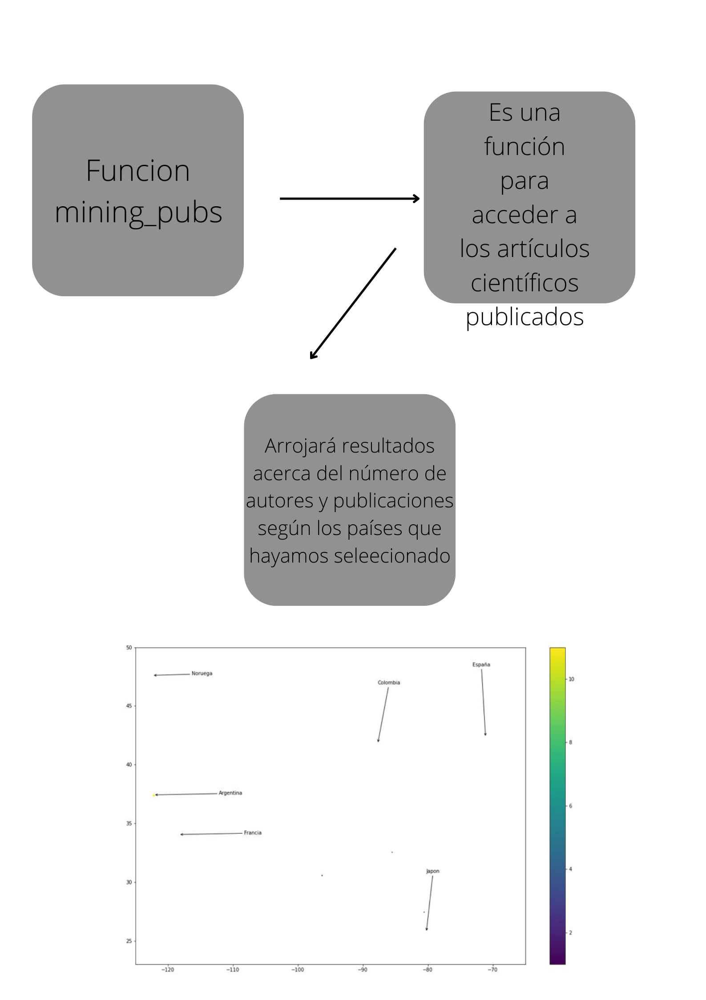

# EXAMEN_PARCIAL2
## DATOS PERSONALES
- Gómez Akira
- Ing. Biotecnología
- Manta
- Mestizo
- Español e Inglés
- Femenino
- 62 kg
- Altura 1.58 cm

## DETALLES DEL EQUIPO
1. LAPTOP-SGT0S2PP
2. PROCESADOR AMD RYZEN 5 4500U WITH RADEON GRAPHICS
3. 2.38 GHz
4. SISTEMA OPERATIVO DE 64 bits

## Versiones de programa
- Python 3.10 (64 bit)
- Anaconda Navigator 2.2.0
- Jupyter Notebook 6.4.8
- Biopython 1.79
- csv 1.0
- re 2.2.1
- pandas 1.4.2
- numpy 1.21.5
- matplotlib 3.5.1
- seaborn 0.11.2

